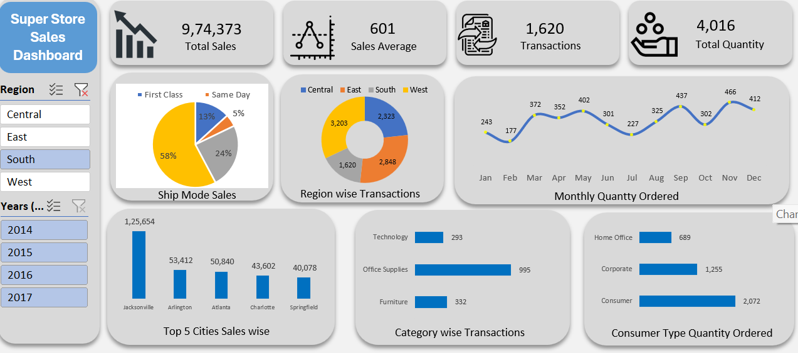

# Superstore Sales Analytics Dashboard

An interactive end-to-end sales analytics dashboard developed using Microsoft Excel to analyze supermarket sales data and generate meaningful business insights.

The dashboard provides an interactive view of sales performance across regions, shipping modes, cities, product categories, customer segments, and monthly trends. It uses Pivot Tables, Pivot Charts, Slicers, and data visualization techniques to transform raw sales data into an easy-to-understand business intelligence dashboard.

## Dashboard Preview



## Project Overview

The objective of this project is to analyze supermarket sales data and create an interactive dashboard that helps users understand sales performance and identify important business trends.

The dashboard allows users to filter the analysis by:

- Region
- Year

The visualizations dynamically update based on the selected filters, making the dashboard interactive and suitable for business reporting and decision-making.

## Key Dashboard Metrics

The dashboard currently provides the following key performance indicators:

- **Total Sales:** 974,373
- **Sales Average:** 601
- **Total Transactions:** 1,620
- **Total Quantity Ordered:** 4,016

## Key Analysis

### 1. Ship Mode Analysis
Analyzes the distribution of sales across different shipping modes, including:

- First Class
- Same Day
- Second Class
- Standard Class

### 2. Regional Transaction Analysis
Provides a comparison of transactions across:

- Central
- East
- South
- West

### 3. Monthly Quantity Trend
A monthly trend visualization shows how the quantity ordered changes throughout the year and helps identify seasonal patterns.

### 4. Top 5 Cities by Sales
Identifies the top-performing cities based on sales revenue.

### 5. Category-wise Transactions
Analyzes transactions across major product categories:

- Technology
- Office Supplies
- Furniture

### 6. Customer Segment Analysis
Shows quantity ordered across different customer segments:

- Consumer
- Corporate
- Home Office

## Tools & Technologies

- **Microsoft Excel**
- Pivot Tables
- Pivot Charts
- Slicers
- Excel Formulas
- Data Cleaning
- Data Analysis
- Data Visualization
- Dashboard Design

## Skills Demonstrated

This project demonstrates practical skills in:

- Data Cleaning and Preparation
- Exploratory Data Analysis
- Business Data Analysis
- KPI Development
- Interactive Dashboard Development
- Pivot Table and Pivot Chart Analysis
- Data Visualization
- Trend Analysis
- Sales Performance Analysis
- Business Reporting

## Dashboard Features

- Interactive Region slicer
- Interactive Year slicer
- KPI cards for important metrics
- Dynamic charts and visualizations
- Monthly trend analysis
- Regional comparison
- City-level sales analysis
- Product category analysis
- Customer segment analysis

## Project Structure

```text
superstore-sales-analytics-dashboard/
│
├── Superstore_Sales_Dashboard.xlsx
├── dashboard.png
└── README.md
